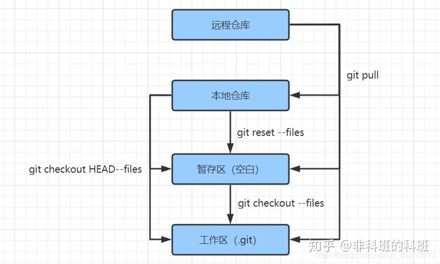
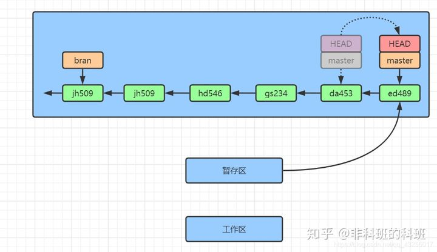
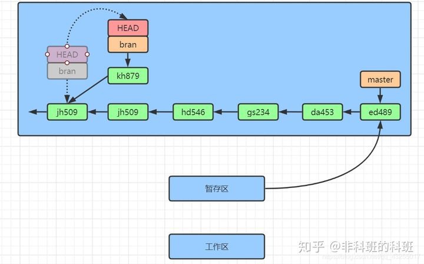

## 对比Git 与 SVN

### 一、Git vs SVN

Git是分布式的，SVN是集中式的

> SVN管理的模式从SVN服务器中拉取代码，然后开始自己的开发，开发完后再向SVN服务器提交代码，所以集中式的版本管理，需要联网才能进行，一旦没网就没办法向SVN服务器提交代码。
>
> 而Git是分布式的版本管理，每个开发者的本地都会有完整的版本库，不需要来联网，也能进行版本的管理和代码的提交，每个开发者都可以再本地进行提交代码、查看版本、切换分支等操作。

Git复杂概念多，SVN简单易上手

Git分支廉价，SVN分支昂贵


### 二、Git核心概念

Git 最核心的一个概念就是工作流

- **工作区(Workspace)**是电脑中实际的目录。
- **暂存区(Index)**类似于缓存区域，临时保存你的改动。
- **仓库区(Repository)**，分为本地仓库和远程仓库。

通常提交代码分为几步：

1. `git add`从工作区提交到暂存区
2. `git commit`从暂存区提交到本地仓库
3. `git push`或`git svn dcommit`从本地仓库提交到远程仓库


### 三、建立git仓库

[知乎](https://zhuanlan.zhihu.com/p/263050507)

`git config --global user.name "xyzhang"`    配置自己用户名和Email

`git config --global user.email "584988593@qq.com"`

`mkdir github`    **创建目录，并且初始化自己的本地仓库**

`cd github`

`git init`    初始化后会默认在主干上(master)

本地仓库与Github关联

c盘下的 .ssh 文件夹下，有 `id_rsa.pub` 和 `id_rsa` 两个文件，分别为公钥和私钥。如果没有，用：

`ssh-keygen -t rsa -C "你注册的邮箱"`

生成（记得自己设定密码），把公钥复制粘贴配置到Github上 `SSH Keys` 页面（`New SSH Key`->`Add SSH Key`）

在Github中创建仓库测试：

在Github上的右上角，`new repo`，填写仓库名`learngit`，设置属性，`Add a README file`

本地仓库文件同步到GitHub中：

`git remote add origin https://github.com/zxytju94/learngit.git`

添加后，远程库的名字就是`origin`，这是Git默认的叫法，也可以改成别的，但是`origin`这个名字一看就知道是远程库。

下一步，就可以把本地库的所有内容推送到远程库上（本地库的管理下篇说），注意输入github的用户名和密码：

```ba
$ git push -u origin master
Username for 'https://github.com': zxytju94
Password for 'https://zxytju94@github.com': 
Counting objects: 23, done.
Delta compression using up to 8 threads.
Compressing objects: 100% (17/17), done.
Writing objects: 100% (23/23), 2.14 KiB | 1.07 MiB/s, done.
Total 23 (delta 5), reused 0 (delta 0)
remote: Resolving deltas: 100% (5/5), done.
To https://github.com/zxytju94/learngit.git
 * [new branch]      master -> master
Branch 'master' set up to track remote branch 'master' from 'origin'.
```

把本地库的内容推送到远程，用`git push`命令，实际上是把当前分支`master`推送到远程。

由于远程库是空的，我们第一次推送`master`分支时，加上了`-u`参数，Git不但会把本地的`master`分支内容推送的远程新的`master`分支，还会把本地的`master`分支和远程的`master`分支关联起来，在以后的推送或者拉取时就可以简化命令。

从现在起，只要本地作了提交，就可以通过命令：

` git push origin master`

把本地`master`分支的最新修改推送至GitHub，现在，你就拥有了真正的分布式版本库。

这有一点说明的就是这里配置的是https的方式，可以配置成ssh的方式，因为http上的方式每次推向远程仓库的时候都会让你输入密码，有点麻烦，切换方法如下：

1. open Terminal

2. Change the current working directory to your local project

3. List your existing remotes in order to get the name of the remote you want to change

   $ git remote -v

   \# origin https://github.com/USERNAME/REPOSITORY.git (fetch)

   \# origin https://github.com/USERNAME/REPOSITORY.git (push)

4. Change your remote's URL from HTTPS to SSH with the `remote set-url` command.

   `git remote set-url origin git@github.com:USERNAME/REPOSITORY2.git`

5. Verify that the remote URL has changed.

   $ git remote -v

   \# Verify new remote URL

   \# origin git@github.com:USERNAME/REPOSITORY2.git (fetch)

   \# origin git@github.com/USERNAME/REPOSITORY2.git (push)

### 四、Git原理

在Git中有四个概念：**「远程仓库、工作区、暂存区、版本库」**。远程仓库就是我们Git的服务器，用于存储已经管理团队的代码。

工作区、暂存区、版本库是我们本地的，例如当我们初始化`git init`后，就会在当前的目录下出现`.git`目录，**「redis目录就是我们的工作区，而.git目录是我们的版本库所有的版本信息都在这里」**。

在.git目录下index文件(`.git/index`)，这就是**「暂存区」**，叫做`stage`或者`index`，index和我们的数据库的index类似，所以我们有时候也叫它为**「索引」**。

初始化的时候Git还会自动为我们创建第一个分支`master`，以及指向master的一个指针叫做`HEAD`。


#### 克隆项目

在我们实际的工作环境中，都会从服务器上进行克隆项目到本地，Git中使用`git clone`命令可以进行克隆项目：

执行`git clone`就会生成一份副本，在本地仓库和工作区都会同步副本，具体的原理图如下所示：


#### 提交代码

从上面的图中我们可以到，代码可以在不同level之间移动，高level到低level，或者逆向低level到高level，也可以跨level之间移动。

Git中代码从低level到高leve的移动主要依靠以下命令：

- `git add .`：文件添加进暂存区。
- `git commit -m "提交信息"`：文件添加进本地仓库，-m参数改为-am可以直接推向本地仓库。
- `git push`：文件推向远程仓库。


运行`git commit -a`相当于运行`git add`把所有文件加入暂存区，然后再运行`git commit`把文件提交本地仓库。

#### 代码回退

那么从高level向低level移动代码的命令如下：

- `git pull`：从远程仓库拉取代码到本地。
- `git reset --files`：用本地仓库覆盖暂存区中修改，也就是覆盖最后一次git add的内容。
- `git checkout --files`：把文件从暂存区复制到工作区，用于放弃本地的修改。
- `git checkout HEAD --files`：回退最后一次的提交内容。




`git status`：查看工作区文件状态，Untracked files：未被追踪的文件，**「表示该文件未被git追踪管理」**。

新添加的文件可以通过**「git add添加到在暂存区」**，**「这样文件就能够被git进行追踪」**，此时再使用`git status`查看文件时，就可以看到两个文件已经是以new file的形式进行显示。

如果此时想撤销提交到暂存区的内容，可以使用 `git reset`，可以撤销向暂存区新添加的文件。

也可以使用命令：`git reset --hard HEAD^`，表示回退到上一个版本，**「在Git中HEAD表示当前版本，HEAD^表示上一个版本」**，若是有多个版本，这样表示就不方便了，可以使用`HEAD~10`，表示版本的次数。

在Git每一个commit都会有自己的commit的ID，可以通过`git log`进行查看：

`commit`的本质就是：**「每次Git都会用暂存区的文件创建一个新的提交，把当前的分支指向新的提交节点，这样就完成了一次新的提交」**：



若是`HEAD`指针指向的是`bran`分支，那么新的节点就会成为`jh509`的子节点，并且形成新的分支：



也就可以使用`git log --pretty=oneline`：直接输出commit的ID，信息比较简短，然后直接指定ID的回退：

`git reset --hard  5567a`

当你再次检查你的代码的时候就会回到了id为5567a版本，在Git的版本回退原理中，Git的内部有一个指当当前版本的HEAD指针，只要从当前版本指回去就行了，所以Git版本的回退是特别快的，只需要移动指针。

#### 撤销修改

在我的本地我直接修改：README.md文件，然后使用git status进行查看，他表示文件处于modified状态： 

此时的README.md文件是还没有被添加进暂存区的，可以直接使用以下命令，撤销掉工作区的修改：

`git checkout -- README.md`

若是已经添加到暂存区了，就是用以下的命令进行回撤：

`git reset HEAD README.md`

当你提交了修改后，可以使用`git diff`查看两次提交之间的变动，它的本质就是**「任意比较两个仓库之间的差异」**


#### 删除文件

在工作区直接使用rm fileName，这个操作和linux的命令一样，若是文件已经提交版本库，从版本库中删除文件可以使用git rm命令进行删除，然后提交：

`git rm README.md`

`git commit -m "remove README.md"`

若是删除错了，可以使用`git checkout -- README.md`进行恢复，其原理就是使用版本库的文件替换工作区的文件。

#### 代码冲突

push的本质：**「就是用你本地仓库的commit记录去覆盖远程仓库的commit记录」**

每次push的时候Git就会检查，若是存在这种情况就是push失败，只要先git pull一下，将本地仓库与远程仓库先合并一下，最后push就可以成功了，若是文件中已经存在在冲突代码，只要打开文件重新解决一下冲突即可。

#### 分支管理

有了分支就有了合并和衍合的操作，**「合并」**和**「衍合」**能够**「有效的对代码版本的管理」**。

Git的初始化中有一条默认的主分支叫做`master`，每一次的提交都会串成一条时间线，这就是一条分支，当前分支由`HEAD`指针指向。

当每次发生代码提交的时候，当前指向就会向前形成一个新的版本，假如再创建一个新的分支bran，并且当前的提交指向新的分支，这样新的分支随着时间的推移就会形成许多版本。

当新分支开发完后，提交仓库，并合并到主干master，最后删除bran分支，这样就完成了一次个人的开发：

 所以，假如主分支上只建立一条分支的话，分支的合并是非常快速的，只需要移动master分支到当前提交，然后将HEAD指针指向master，最后删除bran分支就完成了。

但是，事实上并不是这样的，在一个多人协作的开发团队中，往往每个人都会建立自己的分支，有自己的提交，最后合并到主干，当自己提交的时候，远程仓库代码就会存在自己本地仓库并未有的代码，这样就会导致push失败。


## CMAKE 工具

摘自[cmake手册](https://www.zybuluo.com/khan-lau/note/254724#cmake%E6%89%8B%E5%86%8C)

### 1.作为基础的起始点

最基本的工程是一个从源代码文件中构建可执行文件的例子。对于简单工程，只要一个两行的`CMakeLists`文件就足够了。这将会作为我们指南的起点。这份`CMakeLists`文件看起来像是这样：

```cmake
cmake_minimum_required (VERSION 2.6)
project (Tutorial)
add_executable(Tutorial tutorial.cxx)
```

注意到这个例子在`CMakeLists`文件中使用了小写。`CMake`支持大写、小写、混合大小写的命令。tutorial.cxx中的源代码用来计算一个数的平方根，并且它的第一版非常简单，如下所示：

```c++
// A simple program that computes the square root of a number
// 计算一个数的平方根的简单程序
#include <stdio.h>
#include <stdlib.h>
#include <math.h>
int main (int argc, char *argv[]) {
  if (argc < 2) {
    fprintf(stdout,"Usage: %s number\n",argv[0]);
    return 1;
  }
  double inputValue = atof(argv[1]);
  double outputValue = sqrt(inputValue);
  fprintf(stdout,"The square root of %g is %g\n", inputValue, outputValue);
  return 0;
}
```

我们添加的第一个特性用来为工程和可执行文件指定一个版本号。虽然你可以在源代码中唯一指定它，但是你在`CMakeLists`文件中指定它可以提供更好的灵活性。如下所示，我么可以通过添加一个版本号来修改`CMakeLists`文件：

```cmake
cmake_minimum_required (VERSION 2.6)
project (Tutorial)
# 版本号
set (Tutorial_VERSION_MAJOR 1)
set (Tutorial_VERSION_MINOR 0)
# 配置一个头文件，通过它向源代码中传递一些CMake设置。
configure_file (
  "${PROJECT_SOURCE_DIR}/TutorialConfig.h.in"
  "${PROJECT_BINARY_DIR}/TutorialConfig.h"
  )
# 将二进制文件树添加到包含文件的搜索路径中，这样我们可以找到TutorialConfig.h
include_directories("${PROJECT_BINARY_DIR}")
# 添加可执行文件
add_executable(Tutorial tutorial.cxx)
```

由于配置过的文件将会被写到二进制文件目录下，我们必须把该目录添加到包含文件的搜索路径清单中。然后，以下的代码就可以在源目录下创建一份`TotorialConfig.h.in`文件：(`.h.in` 文件是生成h文件的，可以根据编译条件生成头文件)

```c++
// 与tutorial相关的配置好的选项与设置；
#define Tutorial_VERSION_MAJOR @Tutorial_VERSION_MAJOR@
#define Tutorial_VERSION_MINOR @Tutorial_VERSION_MINOR@
```

当`CMake`配置这份头文件时，`@Tutorial_VERSION_MAJOR@`和`@Tutorial_VERSION_MINOR@`的值将会被从`CMakeLists`文件中传递过来的值替代。下一步，我们要修改tutorial.cxx来包含configured头文件然后使用其中的版本号。修改过的源代码展列于下：

```c++
// 计算平方根的简单程序。
#include <stdio.h>
#include <stdlib.h>
#include <math.h>
#include "TutorialConfig.h"      // added
int main (int argc, char *argv[]) {
  if (argc < 2) {
    fprintf(stdout,"%s Version %d.%d\n",
            argv[0],
            Tutorial_VERSION_MAJOR,
            Tutorial_VERSION_MINOR);     // added
    fprintf(stdout,"Usage: %s number\n",argv[0]);
    return 1;
  }
  double inputValue = atof(argv[1]);
  double outputValue = sqrt(inputValue);
  fprintf(stdout,"The square root of %g is %g\n", inputValue, outputValue);
  return 0;
}
```

### 2.引入库

现在我们将会在我们的工程中引入一个库。这个库会包含我们自己实现的计算一个数的平方根的函数。可执行文件随后可以使用这个库文件而不是编译器提供的标准开平方函数。在本指南中，我们将会把库文件放到一个子目录MathFunctions中。它包含下述的单行`CMakeLists`文件：

```cmake
add_library(MathFunctions mysqrt.cxx)   #added
```

源文件mysqrt.cxx有一个叫做mysqrt的函数，它提供了与编译器的`sqrt`函数类似的功能。为了使用新的库，我们在顶层的`CMakeLists`中增加一个`add_subdirectory`调用，这样这个库也会被构建。我们也要向可执行文件中增加另一个头文件路径，这样就可以从MathFunctions/mysqrt.h头文件中找到函数的原型。最后的一点更改是在向可执行文件中引入新的库。顶层`CMakeLists`文件的最后几行现在看起来像是这样：

```cmake
include_directories ("${PROJECT_SOURCE_DIR}/MathFunctions")  #added
add_subdirectory (MathFunctions)     #added
# 引入可执行文件
add_executable (Tutorial tutorial.cxx)
target_link_libraries (Tutorial MathFunctions)  #added
```

> ***注***：**`PROJECT_BINARY_DIR`** 和 **`PROJECT_SOURCE_DIR`** 的区别：
>
> cmake ./     这样使用的话，是等价的，表示当前源码的目录。
>
> 若执行 cmake 且不在源码路径，比如 cmake ../src
>
> 这样的好处是cmake生成的文件和编译出来的东西，就不放在源码路径下了，保证了源码路径的干净整洁。
>
> PROJECT_BINARY_DIR=全路径/build
>
> PROJECT_SOURCE_DIR=全路径/src

现在，让我们考虑下让MathFunctions库变为**可选的**。在本指南中，确实没有必要这样画蛇添足；但是对于更大型的库或者依赖于第三方代码的库，你可能需要这种可选择性。第一步是为顶层的CMakeLists文件添加一个选项：

```cmake
# 我们应该使用我们自己的数学函数吗？
option (USE_MYMATH "Use tutorial provided math implementation" ON) 
```

这将会在`CMake`的GUI中显示一个默认的ON值，并且用户可以随需改变这个设置。这个设置会被存储在`cache`中，那么用户将不需要在cmake该工程时，每次都设置这个选项。第二处改变是，让链接MathFunctions库变为可选的。要实现这一点，我们修改顶层`CMakeLists`文件的结尾部分：

```cmake
# 添加MathFunctions库吗？
if (USE_MYMATH)
  include_directories ("${PROJECT_SOURCE_DIR}/MathFunctions")
  add_subdirectory (MathFunctions)
  set (EXTRA_LIBS ${EXTRA_LIBS} MathFunctions)
endif (USE_MYMATH)
# 添加可执行文件
add_executable (Tutorial tutorial.cxx)
target_link_libraries (Tutorial  ${EXTRA_LIBS})
```

这里用`USE_MYMATH`设置来决定是否MathFunctions应该被编译和执行。注意到，要用一个变量（在这里是`EXTRA_LIBS`）来收集所有以后会被连接到可执行文件中的可选的库。这是保持带有许多可选部件的较大型工程干净清爽的一种通用的方法。源代码对应的改变相当直白，如下所示：

```c++
// 计算一个数平方根的简单程序
#include <stdio.h>
#include <stdlib.h>
#include <math.h>
#include "TutorialConfig.h"
#ifdef USE_MYMATH
#include "MathFunctions.h"
#endif
int main (int argc, char *argv[]) {
    if (argc < 2) {
        fprintf(stdout,"%s Version %d.%d\n", argv[0],
            Tutorial_VERSION_MAJOR,
            Tutorial_VERSION_MINOR);
        fprintf(stdout,"Usage: %s number\n",argv[0]);
        return 1;
    }
    double inputValue = atof(argv[1]);
#ifdef USE_MYMATH
    double outputValue = mysqrt(inputValue);
#else
    double outputValue = sqrt(inputValue);
#endif
    fprintf(stdout,"The square root of %g is %g\n", inputValue, outputValue);
    return 0;
}
```

在源代码中，我们也使用了USE_MYMATH。这个宏是由`CMake`通过TutorialConfig.h.in配置文件中的下述语句行提供给源代码的：

```c++
#cmakedefine USE_MYMATH
```